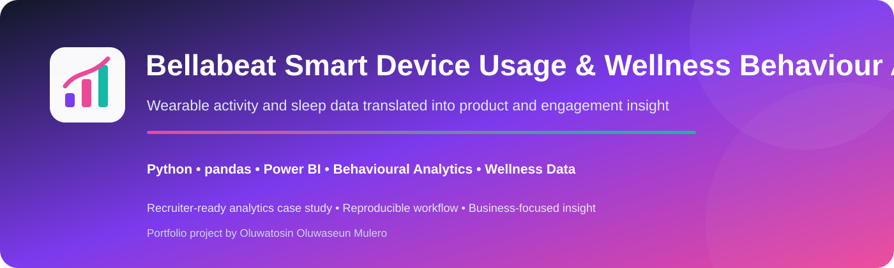
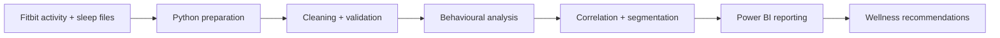

<p align="center">
  
</p>

<p align="center">
  
  
  
  
  
  
</p>

<p align="center"><b>Python • pandas • Power BI • Behavioural Analytics • Wellness Data</b></p>

A Google Data Analytics case study examining Fitbit activity and sleep behaviour to identify product, engagement and wellness-marketing insights. The workflow follows **Ask → Prepare → Process → Analyze → Share → Act**.

> **Scope:** this is a behavioural analytics project, not a clinical study. Findings are observational and based on a limited Fitbit sample.

---

## 🎯 Executive Snapshot

| KPI | Result |
| --- | ---: |
| Main analysis window | **12 Apr–12 May 2016** |
| Average daily steps | **7,801** |
| Average sedentary minutes | **1,083** |
| Average sleep duration | **419 min (~7 h)** |
| Average sleep efficiency | **91.65%** |
| Steps vs calories correlation | **r ≈ 0.58** |
| Valid activity users with ≥14 days | **29** |

---

## 🧩 Business Problem

Bellabeat wants to understand how consumers use smart fitness devices and how behavioural patterns could inform product and marketing strategy.

The project asks:

1. What activity patterns are visible across the week?
2. How much time do users spend sedentary?
3. How do activity and calorie expenditure relate?
4. What sleep patterns are visible?
5. How could users be segmented for more relevant engagement?
6. Which findings are suitable for action, and which require caution?

---

## 🏗️ Analytical Architecture



Full design: [`docs/TECHNICAL_ARCHITECTURE.md`](docs/TECHNICAL_ARCHITECTURE.md)

---

## 📊 Dashboard


---

## 🔎 Key Findings

- Average activity across valid days was approximately **7,801 steps**.
- Users averaged approximately **1,083 sedentary minutes** per valid day.
- **Tuesday** recorded the highest average daily steps at roughly **8,257**, while **Sunday** was lowest at roughly **6,627**.
- Daily steps and calories burned showed a **moderate positive correlation (~0.58)**.
- Average sleep was approximately **419 minutes**, equivalent to about seven hours.
- Sleep duration showed little linear relationship with next-day steps, sedentary minutes or calories in this sample.

---

## 💼 Business Recommendations

- Use personalised activity prompts on lower-activity days.
- Introduce sedentary-time reminders to reduce prolonged inactivity.
- Segment user messaging by activity level rather than applying one generic wellness message.
- Highlight the relationship between movement and calorie expenditure in educational content.
- Treat sleep as one component of overall wellness rather than assuming direct next-day effects.

---

## 🧠 Analytical Engineering

The project demonstrates:

- data-quality review across activity and sleep files;
- date normalisation and duplicate removal;
- incomplete-record validation;
- user-level coverage checks;
- weekday behavioural analysis;
- activity-level segmentation;
- sleep-efficiency calculation;
- correlation analysis;
- Power BI communication of behavioural KPIs.

---

## 🧰 Technology Stack

<p>
  
  
  
  
  
  
  
</p>

**Python · pandas · Matplotlib · Power BI · Jupyter Notebook · Git · GitHub · VS Code**

---

## ✅ Quality & Reproducibility

The repository includes an automated **Portfolio Quality** workflow validating the project structure, dashboard asset and notebook JSON integrity.

---

## ⚖️ Methodology & Limitations

- The sample contains a relatively small number of Fitbit users.
- Tracking completeness varies by user and day.
- Sleep data is available for fewer records than activity data.
- The analysis window is short and should not be treated as representative of the wider population.
- Correlations are observational and should not be interpreted as causal or clinical.

---

## 📁 Repository Structure

```text
bellabeat-wellness-analysis/
├── .github/workflows/portfolio-quality.yml
├── data/
├── docs/
├── images/
│   ├── readme/hero.svg
│   └── bellabeat_dashboard.png
├── notebooks/
│   ├── 01_ask_business_task.ipynb
│   ├── 02_prepare_data.ipynb
│   ├── 03_process_data.ipynb
│   └── 04_analyze_data.ipynb
├── powerbi/
└── README.md
```

---

## 👨🏾‍💻 Author

**Oluwatosin Oluwaseun Mulero**  
**Data Analyst | Data Scientist | Business Intelligence**
