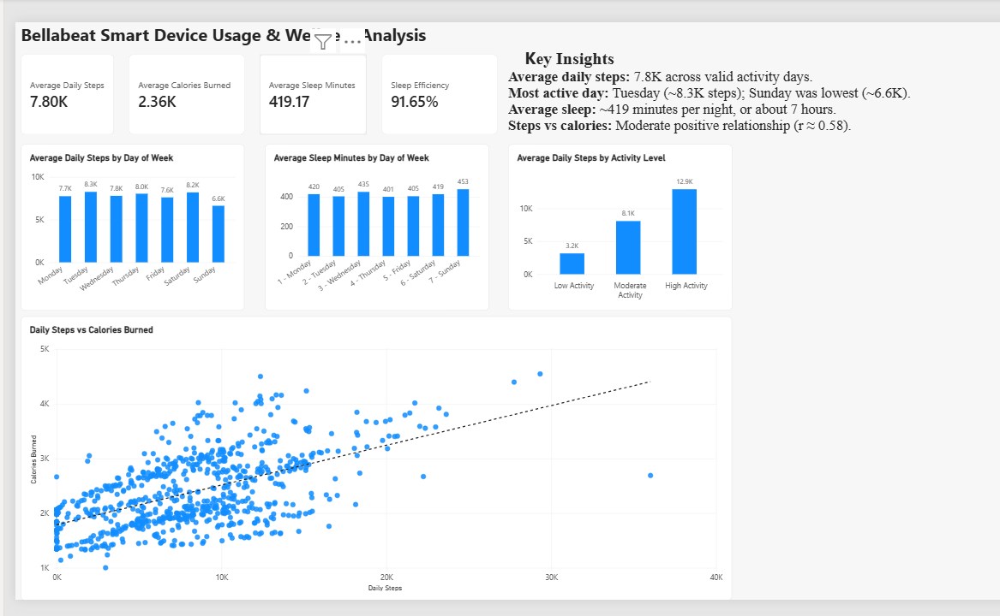

# Bellabeat Smart Device Usage & Wellness Behaviour Analysis

## Project Overview

This project analyses Fitbit smart-device data to identify trends in users' physical activity, sedentary behaviour, sleep patterns, and calorie expenditure.

The analysis was completed as a Bellabeat case study using the Google Data Analytics framework:

**Ask → Prepare → Process → Analyze → Share → Act**

The objective is to translate smart-device usage patterns into practical insights that could support Bellabeat's wellness products and marketing strategy.

## Business Task

Bellabeat wants to better understand how consumers use smart fitness devices and how behavioural trends could inform its product and marketing strategy.

The analysis focuses on three business questions:

1. What are some trends in smart device usage?
2. How could these trends apply to Bellabeat customers?
3. How could these trends help influence Bellabeat's marketing strategy?

The analysis uses Fitbit activity and sleep data to explore patterns in daily steps, active minutes, sedentary behaviour, calorie expenditure, and sleep duration.

## Tools & Technologies

- **Python** — data cleaning, transformation, validation, exploratory analysis, and correlation analysis
- **Pandas** — data manipulation and aggregation
- **Matplotlib** — exploratory visualisation
- **Power BI** — interactive dashboard development and presentation of insights
- **Jupyter Notebook** — documenting the analytical workflow
- **Git & GitHub** — version control and project portfolio hosting

## Data Source

The analysis uses the Fitbit Fitness Tracker dataset provided for the Bellabeat case study.

For the main analysis, the project uses data covering:

**12 April 2016 – 12 May 2016**

The primary datasets used were:

- `dailyActivity_merged.csv` — daily steps, distance, active minutes, sedentary minutes, and calories
- `sleepDay_merged.csv` — daily sleep duration and time spent in bed

The dataset contains anonymised smart-device records from Fitbit users and is used to identify behavioural patterns rather than make clinical or population-wide conclusions.

## Data Limitations

Several limitations should be considered when interpreting the results:

- The dataset includes a relatively small number of Fitbit users.
- Participation and device usage were not consistent across all users and days.
- Some daily activity records contained incomplete tracking periods.
- Sleep data was available for fewer users than activity data.
- The dataset represents a limited time period and should not be treated as representative of the wider population.
- Relationships identified in the analysis are observational and should not be interpreted as causal.

## Key Findings

- Average daily steps across valid activity days were approximately **7,801 steps**.
- **Tuesday** recorded the highest average daily steps at approximately **8,257 steps**, while **Sunday** recorded the lowest at approximately **6,627 steps**.
- Users spent a large proportion of the day sedentary, averaging approximately **1,083 sedentary minutes** on valid activity days.
- Daily steps and calories burned showed a **moderate positive correlation of approximately 0.58**.
- Average sleep duration was approximately **419 minutes per night**, equivalent to about **7 hours**.
- Sunday recorded the highest average sleep duration, while Thursday recorded the lowest.
- Higher-activity user groups recorded more daily steps and very active minutes, while lower-activity groups recorded more sedentary time.
- Sleep duration showed little linear relationship with next-day steps, sedentary minutes, or calories in this dataset.

## Recommendations

Based on the behavioural patterns observed in the dataset, Bellabeat could consider the following actions:

- Use personalised activity reminders to encourage users to increase movement on lower-activity days, particularly Sundays.
- Introduce sedentary-time alerts or movement prompts to help users reduce prolonged inactivity.
- Use activity-level segmentation to tailor wellness messages for low-, moderate-, and high-activity users.
- Highlight the relationship between movement and calorie expenditure in user-facing insights and educational content.
- Use weekday-specific messaging to encourage more consistent activity patterns throughout the week.
- Treat sleep duration as one component of overall wellness rather than assuming it directly predicts next-day activity.

## Power BI Dashboard

An interactive Power BI dashboard was created to communicate the main findings from the analysis.

The dashboard includes:

- Average Daily Steps
- Average Calories Burned
- Average Sleep Minutes
- Average Sleep Efficiency
- Average Daily Steps by Day of Week
- Average Sleep Minutes by Day of Week
- Average Daily Steps by Activity Level
- Daily Steps vs Calories Burned
- Key behavioural insights and summary findings
### Dashboard Preview



## Analysis Workflow

The project followed the Google Data Analytics case study framework:

### Ask
Defined the business task, stakeholders, and analytical questions.

### Prepare
Reviewed the Fitbit datasets, assessed data structure, coverage, limitations, and data quality.

### Process
Cleaned the activity and sleep datasets using Python and Pandas, including:
- date conversion
- duplicate removal
- validation of missing values
- checking invalid or incomplete records
- creation of cleaned analytical datasets

### Analyze
Performed exploratory and behavioural analysis covering:
- daily activity patterns
- weekday activity trends
- activity-level segmentation
- sleep duration and sleep efficiency
- relationships between steps, calories, sedentary time, and sleep
- next-day sleep/activity relationships

### Share
Created a Power BI dashboard to communicate KPIs, behavioural trends, and key insights.

### Act
Developed practical recommendations for Bellabeat based on the observed activity and sleep patterns.

## Project Structure

```text
bellabeat-wellness-analysis/
│
├── data/
│   ├── raw/
│   └── processed/
│
├── notebooks/
│   ├── 01_ask_business_task.ipynb
│   ├── 02_prepare_data.ipynb
│   ├── 03_process_data.ipynb
│   └── 04_analyze_data.ipynb
│
├── powerbi/
│   ├── Bellabeat_Wellness_Analysis.pbix
│   └── data/
│
└── README.md

## How to Run the Project

1. Clone or download this repository.
2. Open the project folder in VS Code.
3. Install the required Python libraries, including Pandas and Matplotlib.
4. Open the notebooks in the `notebooks/` folder in numerical order.
5. Run the notebooks from top to bottom.
6. Open `Bellabeat_Wellness_Analysis.pbix` from the `powerbi/` folder to view the Power BI dashboard.

